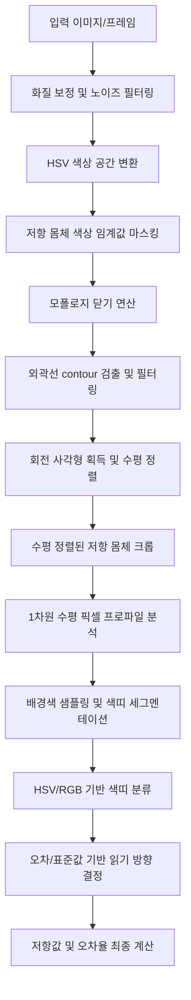

# FindRegister - 이미지 처리 및 저항 분석 알고리즘 명세서

본 문서는 FindRegister 프로젝트에 탑재된 실시간 저항 검출 및 색띠 해독 알고리즘의 세부 구현 사항과 수학적/논리적 동작 구조를 설명합니다.

---

## 1. 이미지 처리 파이프라인 개요

본 애플리케이션은 서버가 필요 없는 클라이언트 사이드 웹 애플리케이션으로, **OpenCV.js (WebAssembly)**를 기반으로 실시간 비디오 프레임 또는 업로드된 정적 이미지를 분석합니다. 전체 파이프라인은 아래와 같습니다:



---

## 2. 세부 단계별 구현 사양

### 2.1 화질 보정 및 전처리
비디오 스트림 혹은 사용자가 업로드한 이미지는 조명 조건이 균일하지 않은 경우가 많습니다. 이에 따라 픽셀 값을 보정하고 노이즈를 감소시키는 전처리를 수행합니다.
*   **밝기(Brightness) & 대비(Contrast) 조정**:
    $$dst(x, y) = src(x, y) \times \alpha + \beta$$
    여기서 $\alpha$는 대비 계수(contrast ratio), $\beta$는 밝기 보정값(bias)입니다.
*   **색포화도(Saturation) 조정**:
    RGB 이미지를 HSV 공간으로 복사하여 $S$ 채널에 스케일링 팩터를 곱한 뒤 다시 변환하여 색상을 인위적으로 선명하게 만듭니다. 반사나 음영으로 인한 색 왜곡을 줄입니다.
*   **가우시안 블러(Gaussian Blur)**:
    카메라 센서에서 발생하는 고주파 노이즈와 미세 텍스처를 제거하기 위해 $5 \times 5$ 크기의 커널을 사용하여 이미지를 평활화합니다.

### 2.2 저항 몸체 세그멘테이션 (HSV Masking)
저항의 몸체는 크게 **황토색/탄색(Tan/Beige)**과 **파란색/초록색(Blue/Green, 정밀 저항)** 두 가지가 주를 이룹니다. HSV(Hue, Saturation, Value) 공간은 조명 강도(V)에 따른 영향이 RGB보다 적어 색상(H) 기반 검출에 적합합니다.

OpenCV.js의 HSV 표현 범위는 $H \in [0, 180]$, $S \in [0, 255]$, $V \in [0, 255]$ 입니다.

*   **일반 저항 (Tan/Beige)** 범위:
    *   $Low = [3, 20, 60]$
    *   $High = [33, 170, 255]$
*   **정밀 저항 (Blue/Green)** 범위:
    *   $Low = [34, 30, 40]$
    *   $High = [135, 255, 255]$

두 범위의 마스크를 생성한 후 `cv.bitwise_or` 연산으로 병합합니다.

### 2.3 모폴로지 연산 및 윤곽선(Contour) 분석
저항 몸체 위에 그려진 색띠(Color Band)들은 배경 몸체 색상 영역에서 제외되어 몸체 마스크가 군데군데 끊기거나 구멍이 뚫리는 현상이 발생합니다.
*   **모폴로지 닫기(MORPH_CLOSE)**:
    $9 \times 9$ 사각형 구조 요소를 사용해 팽창(Dilation) 후 침식(Erosion)을 가함으로써 내부의 구멍(색띠로 인해 단절된 영역)을 채우고 하나의 단일 몸체 형태로 융합합니다.
*   **외곽선 검출 및 필터링**:
    검출된 연결 요소(Contours) 중 다음 기하학적 조건에 부합하는 후보만 저항으로 판별합니다.
    1.  **최소 면적(Area)**: 전체 이미지 화소의 0.15% 이상이어야 함 (노이즈 제거).
    2.  **가로세로 비율(Aspect Ratio)**: 회전된 최소 사각형(`cv.minAreaRect`)을 기준으로 가로와 세로의 긴 변과 짧은 변 비율이 $2.0 \le Aspect \le 6.5$ 범위 내여야 함.
    3.  **밀밀도/볼록성(Solidity)**: 윤곽선의 면적과 볼록 껍질(Convex Hull) 면적의 비율이 $0.65 \le Solidity \le 0.95$ 사이여야 함. (완전한 구형이나 선 형태, 혹은 매우 복잡한 잔해 형태를 필터링).

### 2.4 회전 사각형 수평 정렬 및 크롭 (Straightening)
저항은 정해진 각도 없이 자유롭게 흩어져 배치되므로, 색띠를 일정한 방향으로 스캔하기 위해 강제로 수평 정렬을 거칩니다.
1.  `cv.minAreaRect`에서 얻은 회전각 $\theta$와 중심 좌표 $(c_x, c_y)$를 획득합니다.
2.  가로폭이 세로높이보다 작을 경우, 수직으로 배치된 것으로 판별하고 각도 $\theta$에 $90^\circ$를 더해 가로로 돌립니다.
3.  `cv.getRotationMatrix2D`로 중심점 기준 회전 행렬 $M$을 계산한 후, `cv.warpAffine`을 적용해 전체 이미지를 회전시킵니다.
4.  회전된 이미지에서 수평 상태인 저항 사각형 영역만 관심 영역(ROI, Region of Interest)으로 슬라이싱 크롭합니다.

---

## 3. 색띠 검출 및 색상 분류 알고리즘

수평으로 정렬되어 잘린 저항 이미지(예: $120 \times 40$ 픽셀) 내에서 세로 줄무늬 형태로 색띠가 배열됩니다.

### 3.1 1차원 컬러 프로파일링
*   저항 좌우 양 끝단 리드선과의 연결부 및 그림자 왜곡을 방지하기 위해 가로축 양 끝 10%의 영역은 연산에서 제외합니다.
*   상하 왜곡과 에지 효과를 최소화하기 위해 세로축(Height) 기준 중앙 60% 영역만 가로로 누적 평균을 구합니다.
*   이로써 각 가로 좌표 $x$에 대해 하나의 평균 RGB 및 HSV 벡터가 생성되는 **1차원 데이터 시퀀스**로 변환됩니다.
*   데이터 안정화를 위해 크기가 5인 이동 평균(Moving Average) 필터를 가로 방향으로 적용합니다.

### 3.2 배경색 샘플링 및 색띠 세그멘테이션
*   저항 끝부분의 안전지대(가로 좌우 Margin)에서 샘플링한 평균 RGB 값을 배경 몸체색(Base Color)으로 지정합니다.
*   각 열 $x$의 스무딩된 RGB 색상과 배경 몸체색 간의 유클리드 거리를 측정합니다:
    $$Distance(x) = \sqrt{(R_x - R_{base})^2 + (G_x - G_{base})^2 + (B_x - B_{base})^2}$$
*   거리가 임계값(Threshold = 30)보다 크면 색띠 구역으로 인지하며, 인접한 참(True) 영역들을 묶어 단일 밴드 영역으로 정의합니다.
*   가로폭이 너무 좁거나 넓은 노이즈 세그먼트는 필터링합니다.

### 3.3 색상 분류기 (Color Classifier)
검출된 색띠 세그먼트의 평균 HSV와 RGB 값을 기반으로 다단계 조건문을 적용하여 12가지 표준 색상으로 분류합니다:

```javascript
// Hue(H)는 360도 환산, Saturation(S)과 Value(V)는 100% 환산 기준
if (V < 22) return 'black';
if (V > 75 && S < 15) return 'white';
if (S < 18 && V > 20 && V <= 75) return 'grey';
if (H >= 25 && H <= 49 && S >= 35 && S <= 80 && V >= 30 && V <= 85) return 'gold';
if (H >= 5 && H <= 28 && S >= 20 && V >= 10 && V <= 55) return 'brown';
if ((H >= 0 && H <= 12) || (H >= 345 && H <= 360)) {
  return S > 35 ? 'red' : 'brown';
}
if (H > 12 && H <= 28) {
  return V < 40 ? 'brown' : 'orange';
}
if (h > 28 && H <= 49) return 'yellow';
if (H > 49 && H <= 88) return 'green';
if (H > 88 && H <= 145) return 'blue';
if (H > 145 && H <= 175) return 'violet';
if (S < 25 && V > 50 && V < 85) return 'silver';
```

*위 범위 외의 경계값이나 모호한 스펙트럼의 경우, 12가지 표준 색상 RGB 좌표 테이블 간의 **최소 유클리드 거리**를 측정해 가장 근접한 색상을 결정합니다.*

---

## 4. 저항값 디코딩 및 오류 교정

검출 정렬된 색띠 배열(예: `['red', 'red', 'black', 'brown', 'brown']`)을 수치로 변환합니다.

### 4.1 읽기 방향 판별 알고리즘
저항 몸체가 수평으로 곧게 정렬되어도, 리드선 단자를 기준으로 왼쪽에서 오른쪽으로 읽어야 하는지, 혹은 뒤집혀서 오른쪽에서 왼쪽으로 읽어야 하는지 물리적인 위치만으로는 알 수 없습니다. 이를 소프트웨어적으로 지능형 추정합니다:

1.  **금색/은색 오차 범위 띠 우선 규칙**:
    금색(Gold)과 은색(Silver)은 1번째, 2번째 숫자(또는 3번째 숫자) 띠로 사용되지 않습니다. 즉, 첫 번째 띠로 나타날 수 없습니다. 만약 순방향으로 읽었을 때 첫 번째 띠가 금색이나 은색이고, 역방향(뒤집기)의 마지막 띠가 금색/은색이라면 자동으로 읽는 방향을 **역방향(Reversed)**으로 결정합니다.
2.  **E24 표준 저항값 대조 규칙**:
    두 방향 모두 값을 디코딩해 본 후, 한쪽 방향은 E24 계열의 표준 계수(예: 10, 22, 47, 56 등)에 딱 맞아떨어지고 다른 쪽 방향은 표준값이 아닌 비정상적인 값(예: E24 계열에 없는 수치)을 낸다면, **E24 표준값을 충족하는 방향**을 유효한 방향으로 자동 전환합니다.
3.  **사용자 수동 반전(Flip)**:
    카메라의 빛 반사, 그림자로 인해 방향 추정이 잘못된 경우, 사용자는 화면에 띄워진 저항 카드 또는 Bounding Box를 클릭하여 간편하게 **"읽는 방향 반전"** 버튼을 눌러 디코딩 방향을 토글할 수 있습니다.
